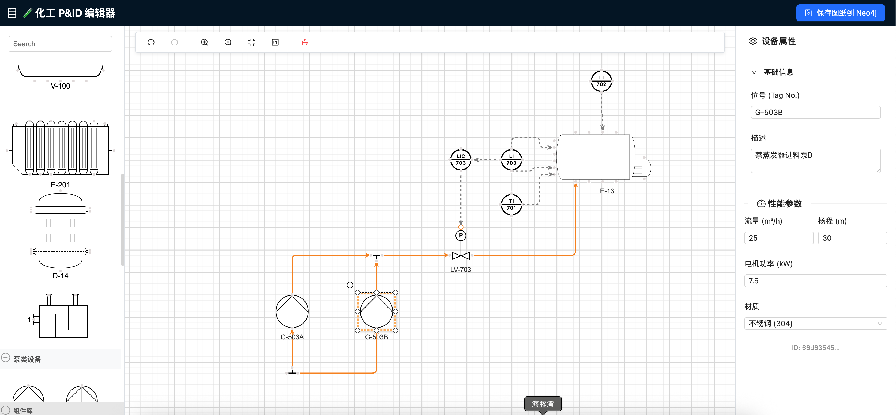
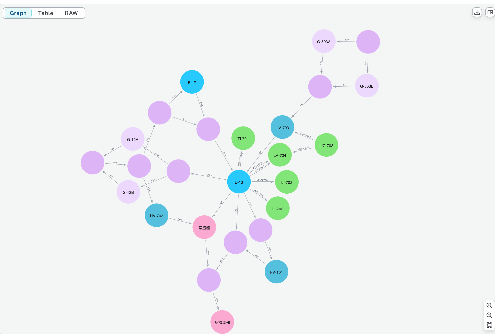

# Chemical P&ID Graph Editor 🏭⚛️

<div align="center">

**连接传统工业图纸与 AI 大模型的桥梁**  
**A Bridge Between Traditional P&ID and Industrial AI Models**

[](LICENSE)


[English](#-english) | [中文](#-中文)

</div>

---

<a name="-english"></a>
## 🇬🇧 English

### 📖 The Story
**This is an open-source project built entirely by a Chemical Industry Expert (with 0 coding background) paired with Google Gemini 3.**

In the digital transformation of the process industry, general LLMs often struggle to understand the complex physical semantics within P&ID drawings (images). For instance, AI finds it difficult to distinguish whether a pipeline connects to the "Shell Side" or "Tube Side" of a heat exchanger, or whether the medium is in a "Vapor" or "Liquid" phase.

This project is not just a drawing tool, but an **Industrial Knowledge Graph Generator**. By utilizing high-fidelity semantic modeling, it converts graphics into structured data containing **Physical Topology** and **Process Logic**, serving as a high-quality data foundation for Industrial RAG (Retrieval-Augmented Generation) and intelligent diagnostics.

### ✨ Core Features

#### 1. 🎨 Professional Visual Editor
*   **Powered by AntV X6**: Delivers a Web-based drag-and-drop experience similar to AutoCAD/Visio.
*   **Smart Routing**: Manhattan orthogonal routing algorithm supporting automatic obstacle avoidance and non-overlapping crossings.
*   **Smart Interaction**: Auto-split pipelines when dragging valves; auto-generate Tapping Points for instruments.

#### 2. 🧠 AI-Native Semantics `NEW`
The graph data generated is designed specifically for AI reasoning, embedding deep physical semantics:
*   **Internal Structure Definition**:
    *   Explicitly distinguishes internal spaces, e.g., **ShellSide** vs. **TubeSide**, **InnerVessel** vs. **Jacket**.
    *   *AI Scenario*: Analyzing heat exchange efficiency or mixing logic.
*   **Phase Awareness**:
    *   Ports carry phase information, e.g., **ShellSide:Vapor** vs. **ShellSide:Liquid**.
    *   *AI Scenario*: Detecting "Dry Run" risks (e.g., ensuring heaters are submerged in liquid) or validating venting/draining logic.
*   **Strict Taxonomy**:
    *   Strictly distinguishes between **Equipment** and **Instrument** in the graph database.
    *   *AI Scenario*: Rapid control loop extraction or asset statistics.

#### 3. 🔗 Graph Database Sync
One-click synchronization to Neo4j, generating an industrial-standard Knowledge Graph:
*   **Node Labels**: `:Thing`, `:Equipment`, `:Instrument`
*   **Relationship Props**: Includes `fromRegion`, `toRegion`, `fluid`, `material`, etc.

### 🧠 AI Reasoning Examples
Once data is stored in Neo4j, you can use Cypher or LLMs to answer complex engineering questions:

1.  **Material Balance Analysis**:
    > "Query E-13 Evaporator: which pipelines are connected to the Liquid Phase area, and which to the Vapor Phase area?"
2.  **Safety Logic Verification**:
    > "Check all heater connections to verify if their corresponding shell-side region is Liquid Phase (to prevent dry heating)."
3.  **Control Loop Extraction**:
    > "Find all temperature control instruments on R-101 Reactor and their associated control valves."

### 🚀 Quick Start

1.  **Prerequisites**: Node.js (v16+) and Neo4j Desktop.
2.  **Clone Repo**:
    ```bash
    git clone https://github.com/ssnchenfeng-ai/chemical-graph-editor.git
    cd chemical-graph-editor
    ```
3.  **Install Dependencies**:
    ```bash
    npm install
    ```
4.  **Configuration**:
    Copy the example env file:
    ```bash
    # Mac/Linux
    cp .env.example .env

    # Windows (CMD)
    copy .env.example .env
    ```
    Edit `.env` and fill in your Neo4j credentials.
5.  **Run**:
    ```bash
    npm run dev
    ```

---

<a name="-中文"></a>
## 🇨🇳 中文

### 📖 项目背景
**这是一个由化工行业资深从业者（0 编程基础），在 Google Gemini 3 全程辅助下完成的开源项目。**

在工业智能化转型中，通用的 AI 大模型（LLM）往往难以理解 P&ID 图纸中复杂的物理含义。例如，AI 很难区分一条管线是连接到了换热器的“壳程”还是“管程”，也无法判断介质是“气相”还是“液相”。

本项目不仅仅是一个绘图工具，更是一个**工业知识图谱生成器**。它通过高保真的语义建模，将图形转化为包含**物理拓扑**和**工艺逻辑**的结构化数据，为工业 RAG（检索增强生成）和智能诊断提供高质量的数据底座。

### ✨ 核心功能

#### 1. 🎨 专业级可视化绘图
*   **基于 AntV X6**: 实现了类似 AutoCAD/Visio 的 Web 端拖拽体验。
*   **智能路由**: Manhattan 正交路由算法，支持管线自动避让、跨越不穿模。
*   **智能交互**: 拖拽阀门自动打断管线、拖拽仪表自动生成测点（Tapping Point）。

#### 2. 🧠 AI 语义增强 (AI-Native Semantics) `NEW`
本项目生成的图谱数据专为 AI 推理设计，包含深度的物理语义：
*   **精细化腔室定义 (Internal Structure)**:
    *   明确区分设备的内部空间，如 **壳程 (ShellSide)** vs **管程 (TubeSide)**，**釜内 (InnerVessel)** vs **夹套 (Jacket)**。
    *   *AI 应用场景*: 分析热交换效率、判断物料是否混合。
*   **相态感知 (Phase Awareness)**:
    *   端口携带相态信息，如 **气相区 (ShellSide:Vapor)** vs **液相区 (ShellSide:Liquid)**。
    *   *AI 应用场景*: 自动检测“干烧”风险（如加热器未浸没在液相中）、验证排污/放空逻辑。
*   **严格的分类体系 (Strict Taxonomy)**:
    *   在图数据库中严格区分 **设备 (Equipment)** 与 **仪表 (Instrument)**。
    *   *AI 应用场景*: 快速提取控制回路，或进行全厂设备资产统计。

#### 3. 🔗 图数据库同步 (Graph Sync)
一键将画布内容同步至 Neo4j，生成符合工业标准的知识图谱：
*   **节点标签**: `:Thing`, `:Equipment`, `:Instrument`
*   **关系属性**: 包含 `fromRegion` (来源腔室), `toRegion` (目标腔室), `fluid` (介质), `material` (材质) 等。

### 🧠 AI 推理示例
当数据存入 Neo4j 后，您可以使用 Cypher 或让 AI 模型回答以下复杂问题：

1.  **物料平衡分析**:
    > "查询 E-13 蒸发器中，哪些管线连接到了液相区 (ShellSide:Liquid)，哪些连接到了气相区 (ShellSide:Vapor)？"
2.  **安全逻辑验证**:
    > "检查所有加热器接口，确认其对应的壳程区域是否为液相？(防止干烧)"
3.  **控制回路提取**:
    > "找出 R-101 反应釜上所有的温度控制仪表及其关联的调节阀。"

## 🔗 生态系统与应用 (Ecosystem)

本项目是**工业 AI 数据的生产者**。
This project serves as the **Data Producer** for Industrial AI.

如果您想了解如何利用生成的图谱数据进行 **RAG（检索增强生成）**、**智能问答**或**工艺推理**，请查看我们的配套开源项目：

👉 **[Industrial GraphRAG Chatbot](https://github.com/ssnchenfeng-ai/my_rag_project)**
*(基于 Python + Streamlit + LangChain + Neo4j 的工业问答系统)*

<div align="center">
  <table>
    <tr>
      <td align="center"><b>Step 1: Data Production</b></td>
      <td align="center"><b>Step 2: Data Consumption</b></td>
    </tr>
    <tr>
      <td align="center">
        <a href=".">
          <b>Chemical Graph Editor</b><br/>
          (React / AntV X6)
        </a>
      </td>
      <td align="center">➡️ Data Sync ➡️</td>
      <td align="center">
        <a href="https://github.com/ssnchenfeng-ai/my_rag_project">
          <b>GraphRAG Chatbot</b><br/>
          (Python / LangChain)
        </a>
      </td>
    </tr>
  </table>
</div>

### 🚀 快速开始

1.  **环境准备**: 确保已安装 Node.js (v16+) 和 Neo4j Desktop。
2.  **克隆项目**:
    ```bash
    git clone https://github.com/ssnchenfeng-ai/chemical-graph-editor.git
    cd chemical-graph-editor
    ```
3.  **安装依赖**:
    ```bash
    npm install
    ```
4.  **配置数据库**:
    复制环境变量模板文件：
    ```bash
    # Mac/Linux
    cp .env.example .env

    # Windows (CMD)
    copy .env.example .env
    ```
    打开 `.env` 文件，填入你的 Neo4j 数据库连接信息：
    ```ini
    VITE_NEO4J_URI=bolt://localhost:7687
    VITE_NEO4J_USER=neo4j
    VITE_NEO4J_PASSWORD=你的数据库密码
    ```
5.  **启动项目**:
    ```bash
    npm run dev
    ```
    浏览器访问 `http://localhost:5173` 即可开始使用。

### 📸 演示截图 (Screenshots)

<div align="center">
    <!-- GitHub 读取图片的路径规则：相对路径指向 public 文件夹 -->
    
    <p><i>Web Editor Interface / 编辑器界面</i></p>
    <br/>
    
    <p><i>Generated Neo4j Graph / 生成的 Neo4j 知识图谱</i></p>
</div>

---

## 🤝 Contribution / 贡献

As a project initiated by a non-programmer, the code structure might not be perfect. Pull Requests and suggestions are warmly welcome!
作为一个非程序员发起的项目，代码结构可能不够完美。非常欢迎专业的开发者提出建议或提交 PR！

Special thanks to **AntV X6** team and **Google Gemini**.

## 📄 License

MIT License