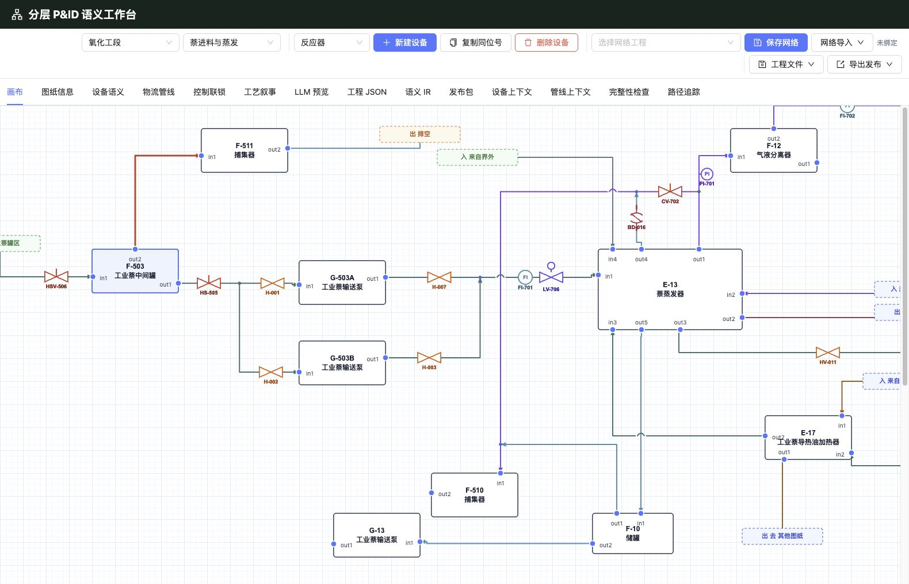
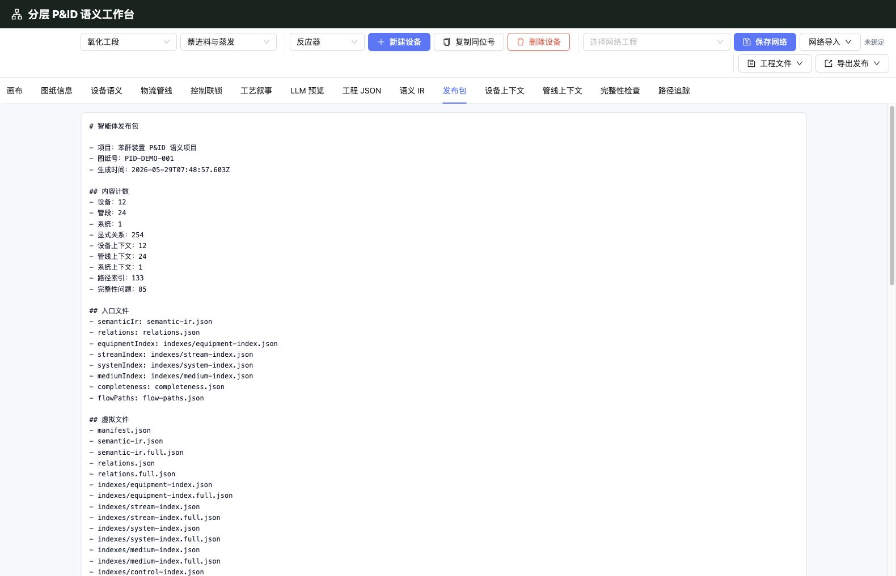

# Chemical P&ID Graph Editor

分层 P&ID 语义工作台，用于把化工 P&ID 图纸整理成适合工程师编辑、也适合 Agent 读取的结构化工程数据。

当前主线不再把“系统”作为工程师需要单独维护的一层。项目采用：

```text
项目 -> 工段/系统 -> 图纸 -> 设备实例、管线、管件、控制联锁、工艺叙事
```

其中“工段”就是系统边界；导出给 Agent 时会自动生成 `systems` 视图，但工程文件本身不再保存独立系统清单。


[中文](#中文) | [English](#english)

---

## 中文

### 项目定位

这个项目的目标不是只做一个画图工具，而是把 P&ID 图纸里的工程语义沉淀成结构化数据：

- 工程师在画布上维护设备、连接桩、管线、阀门、测点、管段接点和控制联锁。
- 工段直接作为系统边界，避免“工段”和“系统”两套层级同时存在造成困扰。
- 同一设备位号可以出现在多张图纸或多个位置，导出时按设备位号归一为一个设备实体，并保留所有画布实例。
- 本地工程可以导入为新的网络工程，也可以追加到当前网络工程，作为新的图纸挂到当前工段下。
- 输出工程 JSON、语义 IR、设备上下文、管线上下文、完整性检查、路径追踪和 Agent 发布包。

### 主要功能

#### 画布编辑

- 基于 React、Ant Design 和 AntV X6。
- 支持设备拖拽、复制同位号、删除设备、调整设备连接桩位置。
- 支持正交管线路由、跨图引用、界外来源/去向、支管点、汇入点、分出点、管线元件和测点。
- 设备移动后会重算相关管线路由和管线元件位置，减少残影和错位。

#### 工段与图纸

- 每张图纸选择所属工段。
- 工段即系统，不再单独维护系统列表。
- 新增、删除、重命名工段和图纸。
- 图纸移动到其他工段后，该图纸上的设备会同步归入目标工段。

#### 网络工程

网络工程是一个轻量文件式协作层，适合在局域网或同一台开发机上多人轮流编辑：

- `保存网络`：保存当前工程到服务端文件夹。
- `本地导入为新工程`：把本地 JSON 工程作为一个新的网络工程。
- `导入到当前工程`：把另一个本地工程追加为当前工程的新图纸。
- 保存时会记录版本，避免直接覆盖已更新的网络工程。

网络工程文件保存在：

```text
network-projects/<project-id>/
  metadata.json
  project.pid-project.json
  versions/
```

这不是实时多人协同编辑引擎；当前没有在线光标、CRDT 合并或权限系统。

#### Agent 导出

当前更推荐把工程数据发布为 Agent 可读取的文件包，而不是让 Agent 直接读画布状态：

- `semantic-ir.json`：精简语义 IR。
- `relations.json`：实体关系。
- `indexes/*.json`：设备、管线、系统、介质索引。
- `contexts/equipment/*.md`：设备上下文。
- `contexts/stream/*.md`：管线上下文。
- `completeness.json`：完整性检查结果。
- `flow-paths.json`：路径追踪结果。

发布包可以下载为 JSON，也可以通过本地开发服务写入：

```text
agent-packages/<package-name>/
```

### 截图

<div align="center">
  
  <p><i>当前画布、工段/图纸、网络工程和导出入口</i></p>
  <br/>
  
  <p><i>Agent 发布包预览，不再是旧版 Neo4j 图谱截图</i></p>
</div>

### 快速开始

#### 安装依赖

```bash
npm install
```

#### 本地启动

```bash
npm run dev
```

访问：

```text
http://localhost:5173
```

#### 局域网网络工程模式

如果需要让同一局域网内的其他电脑访问当前开发服务：

```bash
npm run dev:network
```

终端会输出可访问地址，例如：

```text
http://<your-lan-ip>:5173
```

其他电脑打开该地址后，可以使用同一个 `network-projects` 文件目录进行工程加载和保存。

### 常用工作流

#### 从本地工程进入网络版

1. 打开页面。
2. 点击 `网络导入`。
3. 选择 `本地导入为新工程`。
4. 选择本地 `.json` 工程文件。
5. 系统会创建一个新的网络工程并绑定当前页面。

#### 把第二个本地项目追加到当前工程

1. 先加载或导入第一个网络工程。
2. 切换到目标工段。
3. 点击 `网络导入`。
4. 选择 `导入到当前工程`。
5. 选择第二个本地 `.json` 工程文件。
6. 导入内容会作为新图纸追加到当前工段，跨图引用由工程师后续手工接起来。

#### 导出给 Agent

1. 完成图纸、设备、管线、控制联锁和工艺叙事维护。
2. 点击 `导出发布`。
3. 选择 `导出 IR`、`下载发布包`、`发布到目录`、`导出设备上下文` 或 `导出管线上下文`。
4. Agent 优先读取发布包里的索引和上下文文件，而不是直接理解画布截图。

### 工程文件和存储位置

| 类型 | 存储位置 | 说明 |
| --- | --- | --- |
| 浏览器本地保存 | 浏览器 `localStorage` | 点击 `工程文件 -> 保存本地` 后保存到当前浏览器 |
| 导出工程 | 用户下载的 JSON 文件 | 可再次打开或导入到网络工程 |
| 网络工程 | `network-projects/<project-id>/` | 开发服务端文件式存储，带版本快照 |
| Agent 发布目录 | `agent-packages/<package-name>/` | 发布给 Agent/RAG 使用的上下文包 |

### 关于 Neo4j

仓库里仍保留了早期 Neo4j 相关模块和适配器，但当前主工作台的核心路径已经转向文件式工程、语义 IR 和 Agent 发布包。README 中旧版“一键同步 Neo4j 图数据库”的描述和截图已移除，避免误导当前使用。

### 开发命令

```bash
npm run dev          # 本地开发
npm run dev:network  # 局域网访问
npm run build        # 类型检查和生产构建
npm run lint         # ESLint 检查
```

---

## English

### What This Project Is

Chemical P&ID Graph Editor is a semantic P&ID workspace for process engineering drawings. It helps engineers maintain P&ID topology as structured data, then exports Agent-readable semantic files.

The current model is:

```text
Project -> Stage/System -> Drawing Sheet -> Equipment instances, streams, inline components, controls, narratives
```

The stage is the system boundary. Engineers no longer maintain a separate system layer. Agent exports still contain a derived `systems` view for compatibility and indexing.

### Current Capabilities

- Visual P&ID editing with React, Ant Design, and AntV X6.
- Equipment, ports, pipe groups, streams, inline valves/meters, pipe nodes, external boundaries, and cross-sheet references.
- Stage and drawing management: create, delete, rename, and move drawings between stages.
- Same-tag equipment normalization: repeated drawing instances are exported as one canonical equipment entity.
- Lightweight network project storage under `network-projects/`.
- Local project import as a new network project.
- Local project append into the current network project as additional drawing sheets.
- Agent package export with semantic IR, relations, indexes, equipment contexts, stream contexts, completeness checks, and flow paths.

### Network Project Storage

Network projects are stored as files by the Vite dev server:

```text
network-projects/<project-id>/
  metadata.json
  project.pid-project.json
  versions/
```

This is a lightweight file-based collaboration mode, not a full real-time collaborative editor. It does not currently include presence, live cursors, CRDT merging, authentication, or permission control.

### Agent Package

Agent-oriented output is available from `导出发布`:

```text
manifest.json
semantic-ir.json
relations.json
indexes/
contexts/equipment/
contexts/stream/
completeness.json
flow-paths.json
```

Agents should read these structured files instead of relying on screenshots.

### Screenshots

<div align="center">
  
  <p><i>Current semantic P&ID workspace</i></p>
  <br/>
  
  <p><i>Agent package preview</i></p>
</div>

### Quick Start

```bash
npm install
npm run dev
```

Open:

```text
http://localhost:5173
```

For LAN access:

```bash
npm run dev:network
```

### Notes About Neo4j

Some legacy Neo4j modules still exist in the repository, but the current primary workflow is file-based project storage plus semantic IR and Agent package export. The old Neo4j-centric screenshots and documentation have been removed from this README.

## License

MIT License
